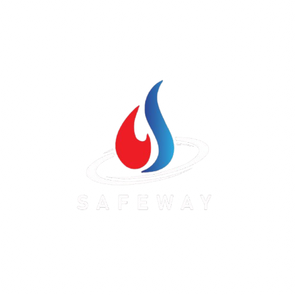
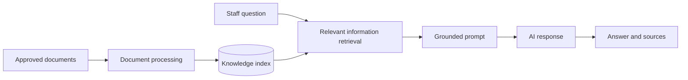

<p align="center">
  
</p>

<h1 align="center">Safeway AI Assistant</h1>

<p align="center">
  A multilingual, document-grounded internal knowledge assistant for Safeway Sdn Bhd.
</p>

## Overview

Safeway AI Assistant helps employees find information from approved handbooks, policies, safety manuals, and standard operating procedures through a conversational interface. Staff can ask questions in English, Malay, or Chinese and review the supporting document sources returned with each answer.

This public repository contains the application source code and a safe local-development overview. Production credentials, infrastructure identifiers, account-provisioning procedures, and internal deployment instructions are intentionally excluded.

> **Project status:** Internal prototype. It must undergo an organization-approved security review before production use.

## Features

### Staff workspace

- Multilingual document questions and conversational follow-ups
- Supporting source excerpts and integrated document preview
- Saved conversation history
- Optional browser-based voice input
- Responsive light and dark interfaces
- Personal profile management

### Administration workspace

- Staff account management
- PDF and TXT knowledge-base uploads
- Document categorization and lifecycle management
- Service and repository overview
- Protected AI response-provider configuration

### Grounded AI responses

- Retrieval-Augmented Generation using approved documents
- Semantic search over indexed document sections
- Backend-controlled prompt construction
- Source-aware responses and safe handling of missing information
- Server-side assistance for selected policy calculations
- Configurable response-provider support

## High-level architecture



Company documents are retrieved at request time and supplied to the response model as controlled context. They are not used to retrain the underlying language model.

## Technology stack

| Layer | Technology |
|---|---|
| Frontend | React, TypeScript, Vite, Tailwind CSS |
| Backend | Python, FastAPI, SQLAlchemy |
| Data | PostgreSQL-compatible cloud database and vector search |
| AI | Semantic embeddings and configurable response generation |
| Documents | PDF/TXT processing and object storage |
| Automation | GitHub Actions and CodeQL |

## Repository structure

```text
ICT_Project_Safeway_Sdn_Bhd/
├── backend/
│   ├── ai/             # AI conversation, retrieval, prompt, and provider modules
│   ├── general/        # Shared authentication, data, email, and history modules
│   ├── main.py         # FastAPI application entry point
│   └── seed_db.py      # Authorized local initialization utility
├── frontend/
│   ├── public/         # Public static assets
│   └── src/            # React application source
├── Documentation/     # Public-safe project documentation
└── run_app.py          # Local development launcher
```

## Local development

### Prerequisites

- Python 3.11 or 3.12
- Node.js 20 LTS or later
- Access to authorized development services

### Install the backend

```bash
cd backend
python -m venv venv
source venv/bin/activate
python -m pip install --requirement requirements.txt
```

On Windows PowerShell, activate the environment with:

```powershell
.\venv\Scripts\Activate.ps1
```

### Install the frontend

```bash
cd frontend
npm ci
```

### Configure local environment files

Copy the provided examples without placing credentials in source control:

```bash
cp backend/.env.example backend/.env
cp frontend/.env.example frontend/.env
```

Obtain development credentials and approved configuration values through the project maintainer or the organization’s secret-management process. Do not post them in issues, pull requests, screenshots, documentation, or chat messages.

### Run locally

After the authorized environment values have been configured, run from the project root:

```bash
python run_app.py
```

The local frontend and generated API documentation are available at the addresses printed by the launcher.

## Quality checks

Frontend:

```bash
cd frontend
npm run typecheck
npm run build
```

Backend, from the project root:

```bash
python -m compileall -q backend
```

Continuous integration also performs dependency audits and static security analysis.

## Public-repository security

- Never commit real environment files, credentials, tokens, database addresses, or private keys.
- If a credential is ever committed, revoke and replace it immediately; deleting the file from the latest commit does not remove it from Git history.
- Use local environment files only for development and a managed secret store for deployment.
- Keep production account creation, recovery, and administrative procedures in access-controlled documentation.
- Use synthetic data in examples, tests, screenshots, and demonstrations.
- Review staged changes and repository history before every public push.
- Report suspected security issues privately to the project maintainer rather than opening a public issue.

Prompt safeguards and application-level checks reduce AI-related risk, but they do not replace authentication, authorization, data-access controls, monitoring, and security testing.

## Contributing

1. Create a focused branch for each change.
2. Keep secrets, generated files, and internal operational notes out of commits.
3. Preserve the separation between AI logic, shared backend services, API handling, and frontend presentation.
4. Run the available quality checks before opening a pull request.
5. Request maintainer guidance when a change affects authentication, data access, deployment, or AI-provider configuration.

Public-safe setup notes are available in [Documentation/installing_guide.txt](Documentation/installing_guide.txt).
